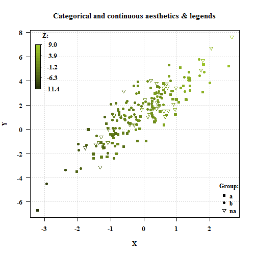
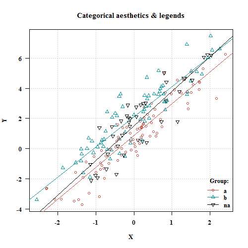
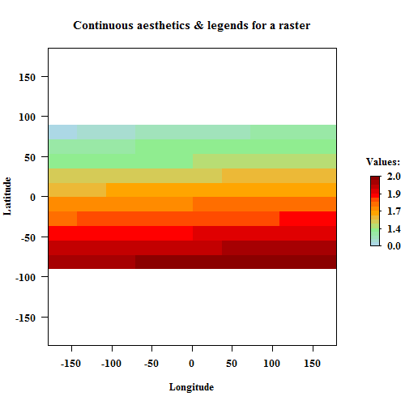

easylegend
==========

_Automatic plot overlay and legend for categorical and continuous 
variables (symbols, colors, ...)_

Author: **Julien MOEYS**.
Package description: See [DESCRIPTION](/pkg/easylegend/DESCRIPTION).

Introduction
------------

`easylegend`  is a [package][RPackages] for the [R Project for 
Statistical Computing][R]

`easylegend` makes it easier to display additional categorical 
or continuous variable(s) (say `Z`) on a plot (`xy` scatter plot, 
image, spatial data), with `Z`-dependent symbol characters and / or
colors (for symbols, lines or fillings), and preparing the plot 
legend(s). Color scales can be categorical (if `Z` is categorical), 
or continuous (if `Z` is continuous).

`easylegend` generates `Z`-dependent plot aesthetics automatically, 
but the user can customise many aesthetics parameters.

Continuous color scales (or ramps) in `easylegend` can be highly 
customised, and support **multi-step color ramps** with intermediate 
color gradient and custom breaks. **The legend for continuous color 
scales is not linearly proportional to `Z`, and thus can be used 
with data that spans across several order of magnitudes** (Such as 
pesticide concentrations, which is the primary motivation for that 
package), or with infinite values in the breaks (_i.e._ Upper or 
lower bounds not clearly defined). They can be used with standard 
plots, but also with `image()` or `raster::plot()`.

Example
-------

Here are a simple examples of what can be obtained with `easylegend`:

### Example 01

The source code for generating this example can be found [here](www/example01.R)

### Example 02

The source code for generating this example can be found [here](www/example02.R)

### Example 03

This example show how `easylegend` can be used with the package 
[raster](http://cran.r-project.org/web/packages/raster/index.html) 
to generate custom legends for data that span across a log-scale. 

The source code for generating this example can be found [here](www/example03.R)

<!--- List of links used in the page -->
[helpPage]:     easylegend/00Index.html "easylegend help page"
[R]:            http://www.r-project.org/ "The R Project for Statistical Computing"
[RPackages]:    http://en.wikipedia.org/wiki/R_%28programming_language%29#Packages "R packages (Wikipedia)" 
